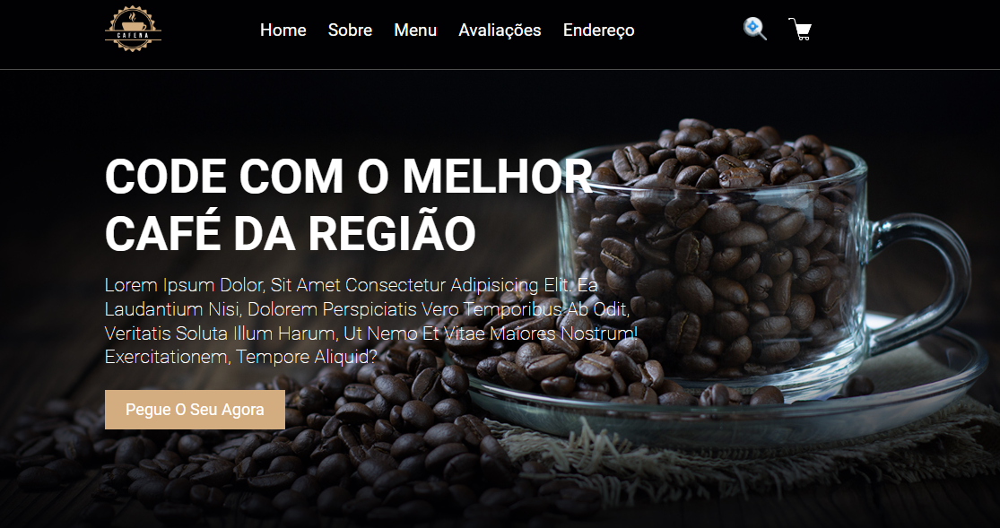

# Cafeteria top+
Um projeto Front-end de um Site de uma cafeteria fictícia para fins de dáticos.

## 👨‍💻 Introdução
O objetivo desse projeto é um site de cafeteria para mostrar a qualidade e características de várias formas de se preparar um café.

## 💻 Pré-requisitos
N/A

## 🔗 Link do Projeto
[Clique Aqui](https://boisterous-lily-443348.netlify.app/)

## ⚙️ Tecnologias 
HTML5 Semantico

CSS3 Grid - layout

Google Fonts

Icons blibioteca

### 🙋 Autores
* **Rodolfo Mori** - *Autor do projeto* - [Rodolfo](https://www.youtube.com/@canaldevclub)
* **jailson** - *FrontEnd do projeto* - [@jailson.silva.oficial](https://www.instagram.com/)

### 🫂 Gratidão agradecimentos
- Obrigado por acompanha o meu projeto até aqui.
- Email de contato para: __jailson.nogueira2@gmail.com__
- WhatsApp: __15 9 8819-6147__
- LinkeDin: [meu_linkedin](https://www.linkedin.com/in/jailsonn-silva/)
